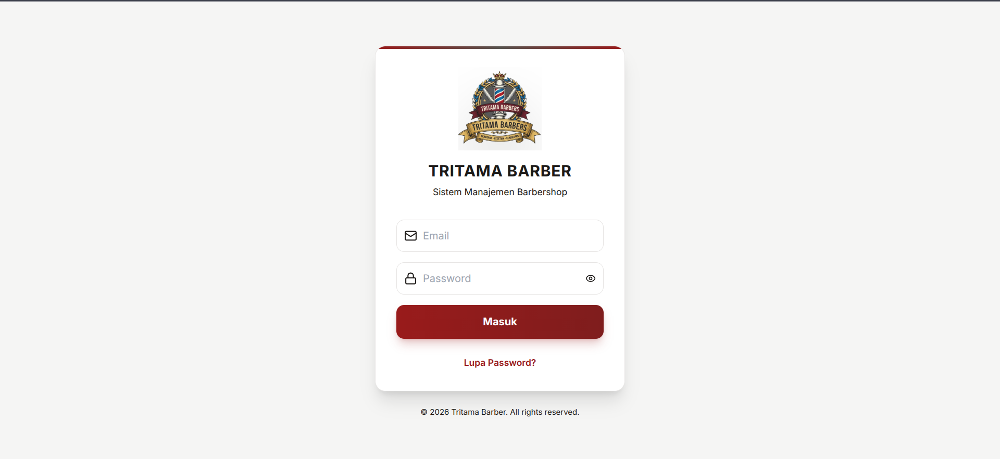
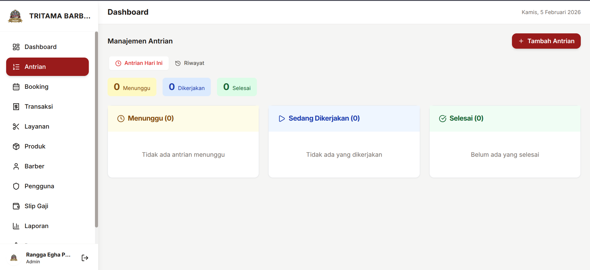

# 💈 Tritama Barber - Sistem Manajemen Barbershop

Sistem manajemen barbershop modern berbasis web dengan fitur lengkap untuk manajemen antrian, booking, transaksi, penggajian, dan laporan.


## 📸 Screenshot

### Login


### Dashboard


### Manajemen Antrian


### Slip Gaji PDF
[Download Sample PDF](screenshots/slip-gaji.pdf)

## ✨ Fitur Utama

### 🎯 Manajemen Antrian
- Sistem antrian real-time dengan nomor urut
- Notifikasi panggilan antrian
- Status: Menunggu → Sedang Dikerjakan → Selesai

### 📅 Booking Online
- Booking janji temu dengan barber pilihan
- Reminder otomatis sebelum jadwal
- Manajemen slot waktu

### 💰 Transaksi & POS
- Point of Sale (POS) terintegrasi
- Multi metode pembayaran (Cash, Debit, QRIS, Transfer)
- Diskon dan promo

### 👨‍💼 Manajemen Barber
- Profil barber dengan spesialisasi
- Sistem komisi otomatis (10%)
- Jadwal kerja

### 💵 Penggajian
- Slip gaji otomatis dengan PDF
- Perhitungan gaji pokok + komisi
- Email notifikasi ke barber

### 📊 Laporan
- Laporan harian, mingguan, bulanan
- Analisis pendapatan dan pengeluaran
- Performa barber

## 🎨 Tema Warna

Tema warna mengikuti logo Tritama Barber:

| Warna | Hex | Penggunaan |
|-------|-----|------------|
| Merah | `#8b1f3a` | Primary, header, button utama |
| Emas | `#c9942e` | Secondary, accent, highlights |
| Cream | `#fdf9ed` | Background, cards |

## 🚀 Teknologi

### Backend
- **Laravel 11** - PHP Framework
- **Laravel Sanctum** - API Authentication
- **MySQL** - Database
- **DomPDF** - PDF Generation
- **Laravel Mail** - Email Notifications

### Frontend
- **React 18** - UI Library
- **Vite** - Build Tool
- **Tailwind CSS** - Styling
- **Axios** - HTTP Client
- **Zustand** - State Management
- **Lucide React** - Icons

## 📁 Struktur Folder

```
barbershop-pos/
├── backend/              # Laravel API
│   ├── app/
│   ├── config/
│   ├── database/
│   ├── resources/views/  # Email templates
│   └── routes/
├── frontend/             # React App
│   ├── src/
│   │   ├── components/   # UI Components
│   │   ├── pages/        # Page Components
│   │   ├── layouts/      # Layout Components
│   │   └── stores/       # State Management
│   └── public/
├── screenshots/          # Screenshot aplikasi
└── README.md
```

## 📝 License

MIT License - Tritama Barber System

---

💈 **Tritama Barber** - Professional Barbershop Management System
